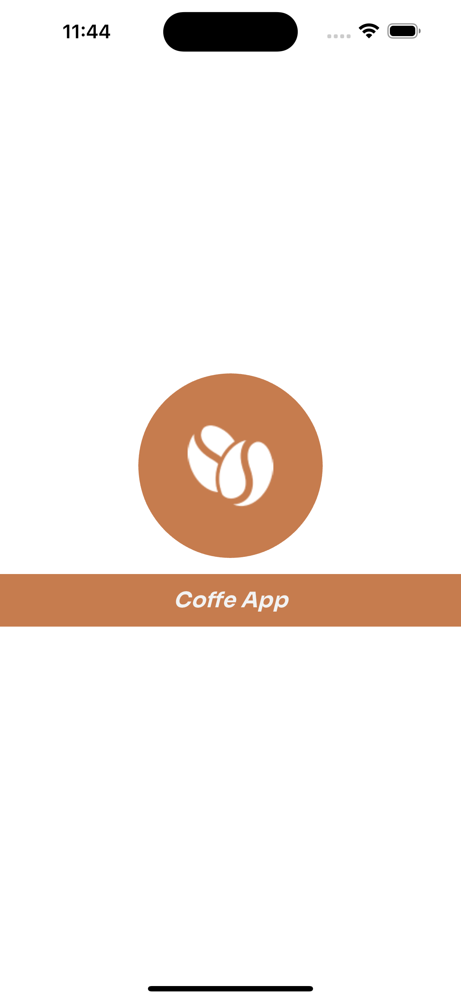
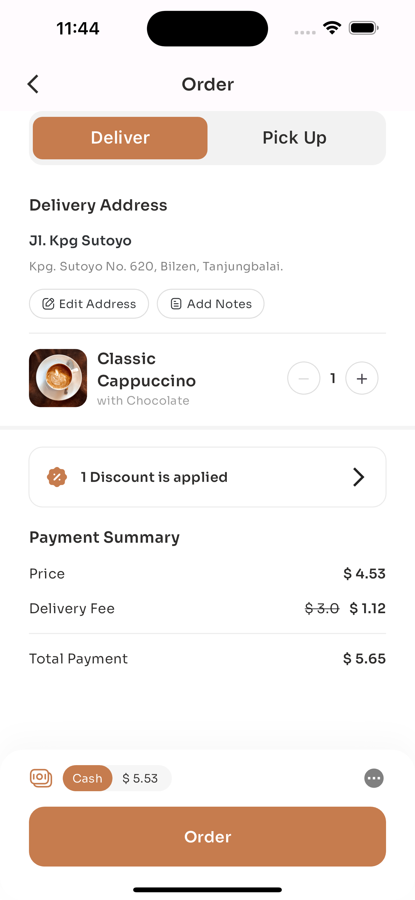

# HeyFlutter Community Coffee App UI Challenge

## Introduction
This repository contains my submission for the HeyFlutter community Coffee App UI challenge.

## My Participation
I actively participated in the HeyFlutter community Coffee App UI challenge and thoroughly enjoyed working on this project.

## Project Code
You can find the code for this Coffee App UI challenge on [GitHub](https://github.com/Shehzaan-Mansuri/coffee-challenge).

## Description
The Coffee App UI challenge revolved around [provide a brief description of the challenge]. In my project, I focused on [briefly outline your approach to the Coffee App UI].

## How to Run
To run this Coffee App UI project, follow these steps:
1. Clone the repository: `git clone https://github.com/Shehzaan-Mansuri/coffee-challenge`
2. cd into the project directory: `cd coffee-challenge`
3. Run the project: `flutter run`

## Acknowledgments
I want to express my gratitude to the HeyFlutter community for organizing this Coffee App UI challenge. For their valuable contributions.

## Screenshots

...

